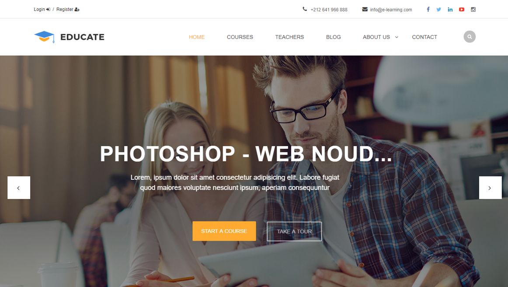

# E-learning Platform

The project is a web platform that makes teachers post courses and blogs and also make students subscribe to their preferred courses and all that managed by an admin panel.
The project developed using PHP Laravel framework with Laravel Voyager for admin dashboard.

### Project structure

*  The ``app/`` folder contains the models.

*  The ``app/Http/Controllers/`` folder contains the controllers.

*  The ``resources/views/`` folder contains the views.

*  The ``public/images/`` folder contains the public files.

*  The ``database/e-learningV.sql`` file contains the database structer.

*  The ``document/`` folder contains the documents related to the project such as presentation and report.

### Running the project

- Install the PHP server ``laragon`` or ``Xampp`` or ``wamp``.

- Create a database in PHP my admin and name it ``e-learningv`` and import the ``database/e-learningV.sql`` database.

- Run ``git clone https://github.com/essanhaji/e-learning.git``

- Run ``composer install``

- Run ``cp .env.example .env`` or ``copy .env.example .env``

- Run ``php artisan key:generate``

- Run ``php artisan migrate``

- Run ``php artisan serve``

- Go to link ``localhost:8000`` for home page

- Go to link ``localhost:8000/admin`` for admin page

- For more information about tools, architecture and conception check the ``document/rapport_final.pdf`` and ``document/presentation.pdf`` files. Note that the report write in french for academic reason.

- If you have any issues feel free to ask us.

### Demo

## Authors

* [El Houcine ES SANHAJI](https://www.linkedin.com/in/essanhaji/)

 

## Thank you.
